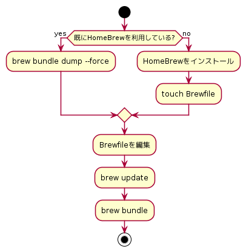

= homebrew as code(mac-app as code?)

== 以下をコードで管理したい

* HomeBrewで入れるパッケージ群
* Macに入れるGUIアプリ

== どんな時に使える？

* Macを買い替えた時
* Macをクリーンインストールした時
* MacのアプリをポチポチDLして入れたくない時

== フローチャート

== Brewfileにない、brewで管理しているパッケージを削除

.確認するだけ
----
$ brew bundle cleanup
----

.実行!!
----
$ brew bundle cleanup --force
----

== 参考

* link:https://github.com/Homebrew/homebrew-bundle[]

* link:https://gurutaka-log.com/mac-environment-brewfile[【Macの環境構築】homebrewとBrewfileでアプリを一括インストールする]

* link:https://qiita.com/vochicong/items/f20afc89a6847cd58f0f[brew bundleでMacのアプリをまとめてインストール・管理]
